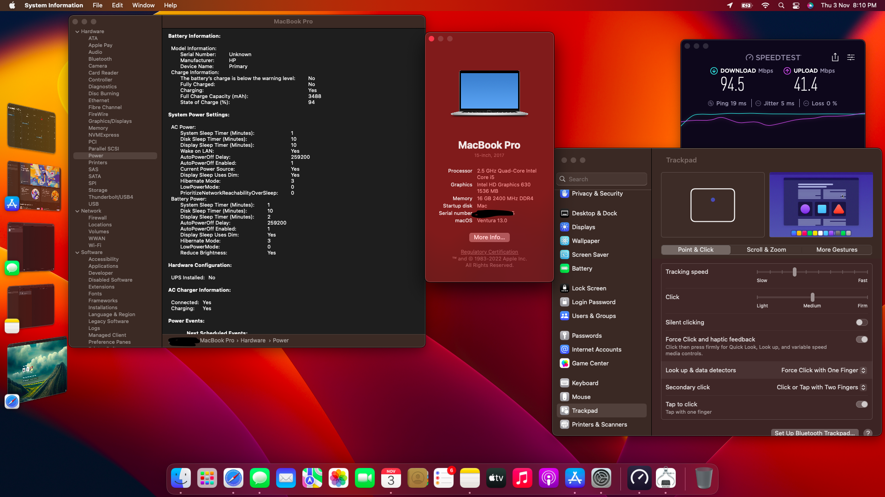
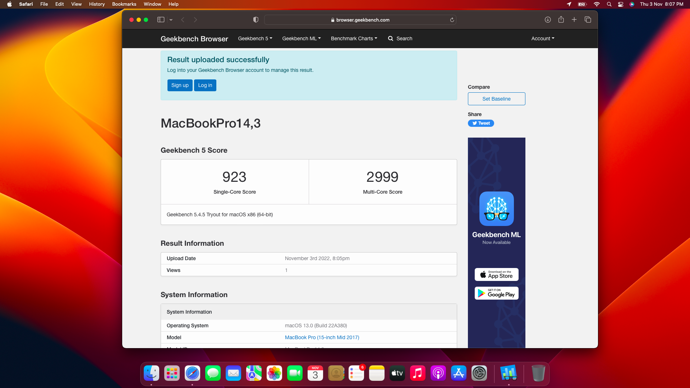
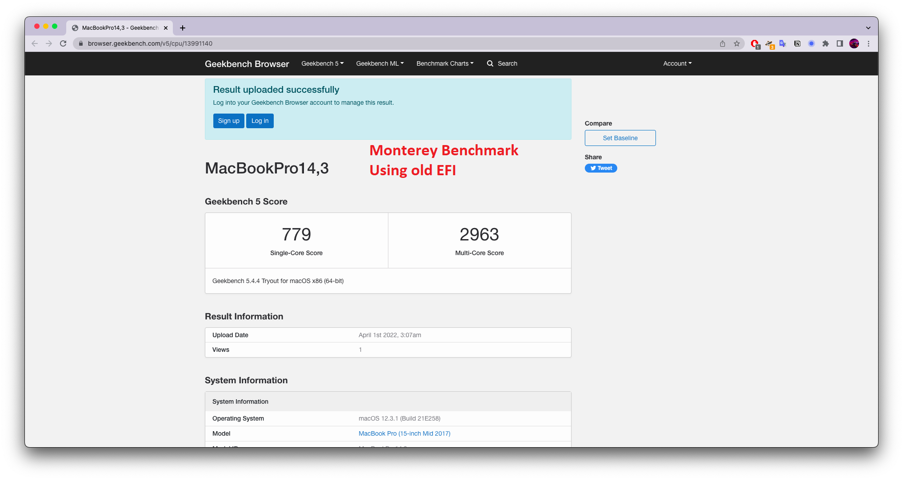
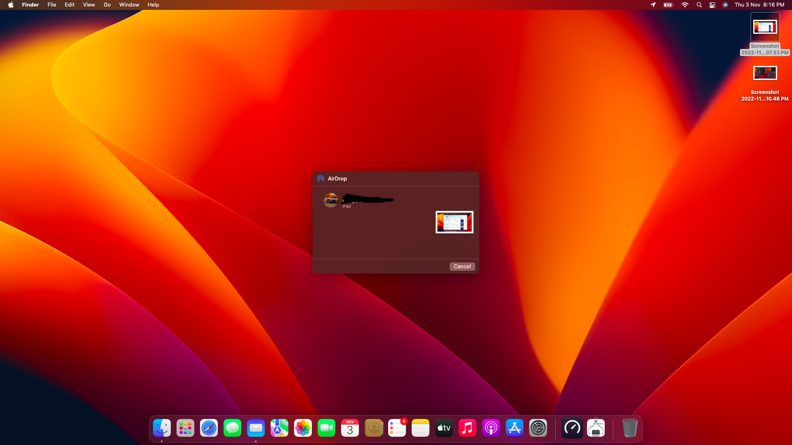

<h1 align="center">HP OMEN 15-ce0xx OC-Ventura 💫</h1>

  
  

> CPU - i5-7300HQ  
> IGPU - Intel HD 630  
> GPU - Nvidia Geforce 1050 (DISABLED)  
> Audio - ALC295  
> WIFI and BLUETOOTH- Intel Dual Band AC-7265

## Preview

## Things to Remember

    Flash your own SMBIOS (MacbookPro14,3)
    Unlock CFG lock for best performance (see guide on Dortania)
    Reset NVRAM atleast twice before installing os and after installation.
    Follow my battery calibration trick mentioned in release post.
   

## Author

👤 **VENOM**

* Github: [@retrohog](https://github.com/retrohog)

## Show your support

Give a ⭐️ if this project helped you!

<a href="https://www.buymeacoffee.com/retrohog">Buy me a Coffee 🥛</a>
