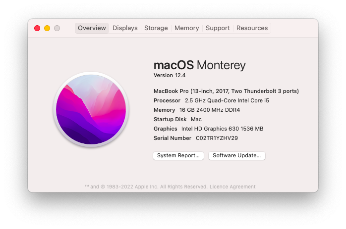
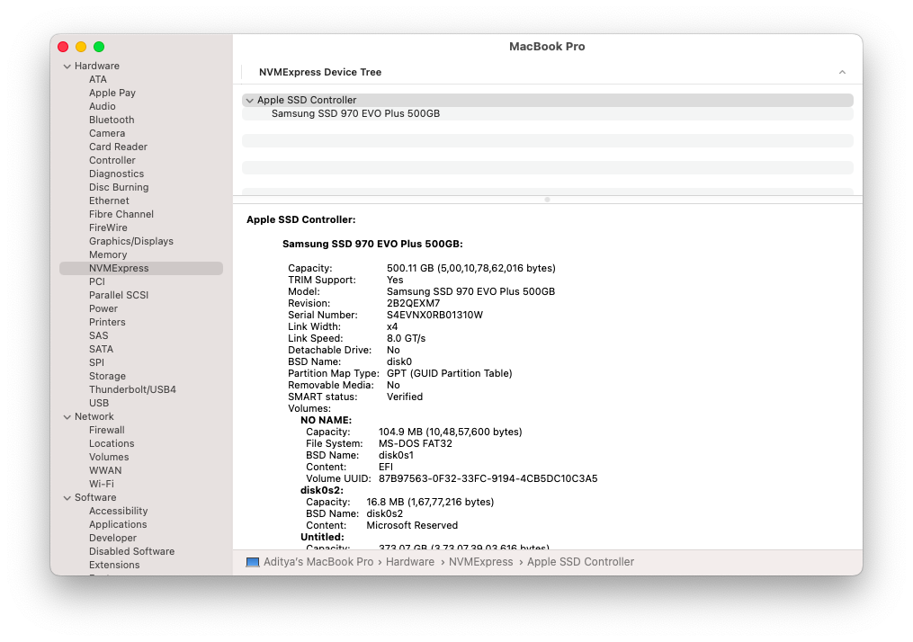
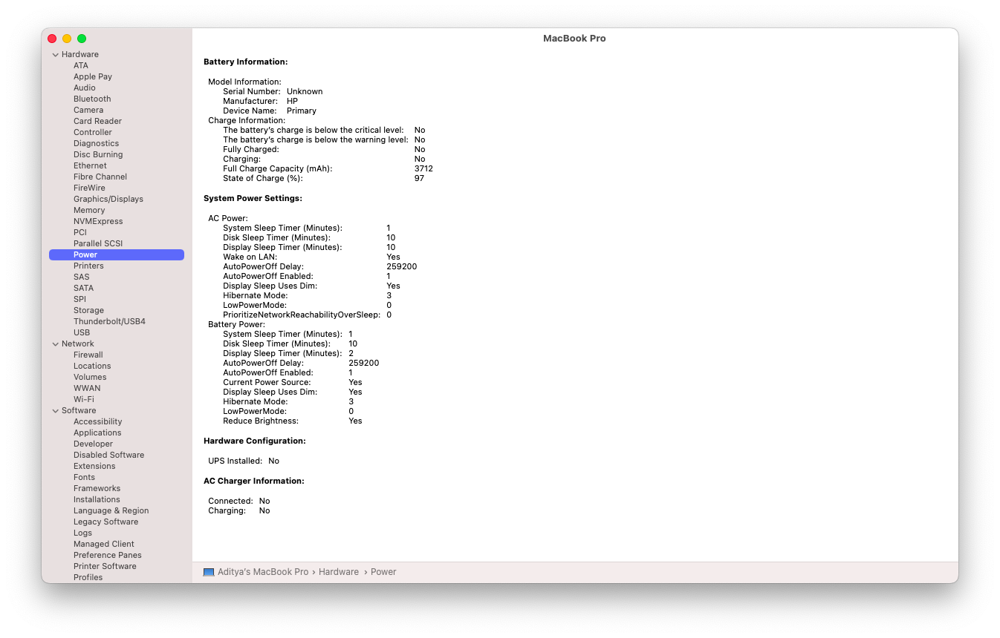

<html>
<h1> &#128250; HP OMEN 15-ce0xx Ventura Opencore EFI</h1>
  <h3> I suggest you to install using olarila vanilla image. <a href="https://www.olarila.com/topic/6278-hackintosh-and-macintosh-olarila-vanilla-images-macos/">Olarila</a></h3>
  
<h2>Device Specs</h2>
  <ul>
  <li>CPU- I5-7300HQ</li>
  <li OMEN 15-ce0xx Ventura Opencore EFI
  <l
  align-items: flex-start;i>DGPU- GTX 1050TI Disabled</li>
  <li>Audio- ALC295 (Layout-id=3)</li>
  <li>Wifi and Bluetooth- Intel Dual Band AC</li>
  </ul>
  

  

<h2>THINGS TO REMEMBER</h2>
<ol>
  <li>Flash your own SMBIOS from SMBIOSGen by acidanthera</li>
  <li>Reset NVRAM for sure</li>
  <li>Charge once full to 100% and drain the battery fully it will calibrate and improve the battery life.</li>
  <li>Unlock CFG lock specifying steps below ** It is mandatory because it will unlock cpu power management which is configured using kexts</li>
  
  <h4>That's all</h4>

<h2>GUIDE FOR UNLOCKING CFG LOCK</h2>
<ol>
  <li>Download Latest Bios firmware ( it will be downloaded in exe format so run it once and it will extract the files in C drive *Run on         Windows*)</li>
  <li>Download Ifrextract from here- https://github.com/donovan6000/Universal-IFR-Extractor.git</li>
  <li>Download UEFITool from here- https://github.com/LongSoft/UEFITool.git</li>
  <li>Extract the Setup.bin PE32 Image Section (the one UEFITool found) through Extract Body menu option.</li>
  <li>Run IFR-Extractor on the extracted file (e.g. ./ifrextract Setup.bin Setup.txt).</li>
  <li>Find CFG Lock, VarStoreInfo (VarOffset/VarName): in Setup.txt and remember the offset right after it (e.g. 0x123).</li>
  <li>Download and run Modified GRUB Shell compiled by brainsucker or use a newer version by datasone.</li>
  <li>Enter setup_var 0x123 0x00 command, where 0x123 should be replaced by your actual offset, and reboot.</li>

Here we go fully stable and everything works no need to work on anything just copy,

IF YOU GET ANY BUGS OR ISSUES PLEASE PULL A REQUEST WILL IMPROVE OR FIX THAT.

  <h2> Big thanks to Mald0n Founder of Olarila helped me to patch ACPI</h2>
Thanks.
  

</body>
  </html>
